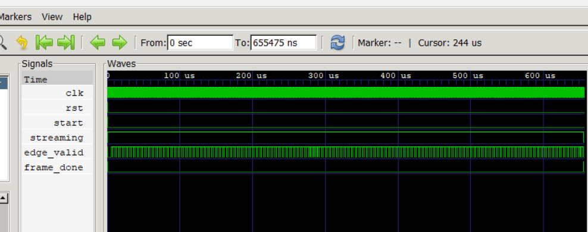
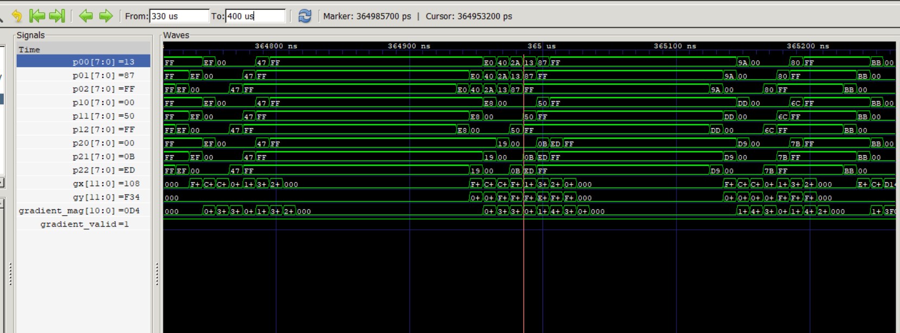
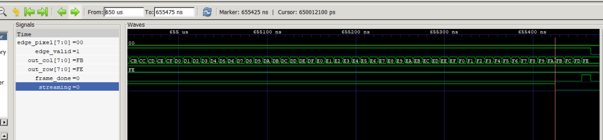

<div align="center">

#  Verilog Sobel Edge Detector Accelerator

### A Modular, Pipelined RTL Implementation of Sobel Edge Detection
<br>


</div>

---

##  Project Overview

Edge detection is a fundamental operation in computer vision used to identify
boundaries, contours, and intensity transitions within an image.

This project implements the **Sobel edge-detection algorithm as a modular
hardware datapath using Verilog RTL**.

Instead of treating Sobel filtering as a software-only image-processing
operation, the algorithm is decomposed into dedicated hardware stages that
process pixels in raster order through a streaming datapath.

The accelerator accepts a **24-bit RGB image**, converts it to grayscale,
generates a **3×3 sliding window**, computes the horizontal and vertical Sobel
gradients, calculates a hardware-efficient gradient magnitude, and produces
a binary edge map.

The complete design was functionally verified using a **self-checking
Verilog testbench**, with waveform-level verification performed using
**GTKWave**.

---

##  What Has Been Built

The complete hardware processing pipeline is:

<div align="center">

```text
                         RGB IMAGE
                             │
                             ▼
                  ┌─────────────────────┐
                  │   RGB → Grayscale   │
                  │       24 → 8 bit    │
                  └──────────┬──────────┘
                             │
                             ▼
                  ┌─────────────────────┐
                  │    3×3 Window       │
                  │       Buffer        │
                  └──────────┬──────────┘
                             │
                             ▼
                  ┌─────────────────────┐
                  │     Sobel Core      │
                  │                     │
                  │    Gx       Gy      │
                  │      \     /        │
                  │    |Gx| + |Gy|      │
                  └──────────┬──────────┘
                             │
                             ▼
                  ┌─────────────────────┐
                  │      Threshold      │
                  │     0x00 / 0xFF     │
                  └──────────┬──────────┘
                             │
                             ▼
                         EDGE MAP
```

</div>

---

##  Key Design Features

- **256×256 RGB image processing**
- **24-bit RGB input**
- **8-bit grayscale datapath**
- **3×3 sliding-window architecture**
- **Sobel X/Y gradient computation**
- **Hardware-efficient `|Gx| + |Gy|` gradient magnitude**
- **Pipelined datapath**
- **Raster-order pixel streaming**
- **Row/column output-coordinate tracking**
- **Configurable edge threshold**
- **Self-checking Verilog testbench**
- **Automated multi-image processing using Python**
- **RTL waveform verification using GTKWave**

---

##  Sobel Edge Detection Theory

For every valid pixel position, the `window_buffer` generates a 3×3
neighborhood:

```text
p00  p01  p02
p10  p11  p12
p20  p21  p22
```

The horizontal Sobel gradient is calculated as:

```text
Gx = (p02 + 2p12 + p22)  - (p00 + 2p10 + p20)
```

The vertical Sobel gradient is calculated as:

```text
Gy = (p20 + 2p21 + p22)- (p00 + 2p01 + p02)
```

The gradient magnitude is approximated using:

```text
G = |Gx| + |Gy|
```

instead of the mathematically exact:

```text
G = √(Gx² + Gy²)
```

### Why `|Gx| + |Gy|`?

The approximation avoids multiplication and square-root operations, resulting
in a simpler and more hardware-friendly datapath.

The resulting gradient magnitude is compared against a configurable
threshold:

```text
Gradient ≥ Threshold  →  0xFF → Edge
Gradient < Threshold  →  0x00 → Non-edge
```

The resulting binary values form the final Sobel edge map.

---

##  RTL Architecture

The design is divided into modular RTL blocks:

| RTL Module | Responsibility |
|---|---|
| `image_memory.v` | Stores and provides 24-bit RGB image pixels |
| `rgb_to_gray.v` | Converts RGB pixels to 8-bit grayscale |
| `window_buffer.v` | Generates the 3×3 sliding pixel window |
| `sobel_core.v` | Computes Gx, Gy and gradient magnitude |
| `threshold.v` | Converts gradient magnitude to binary edge output |
| `sobel_edge_detector.v` | Top-level integration, streaming and control |

### Dataflow

```text
Image Memory
     │
     ▼
RGB → Grayscale
     │
     ▼
3×3 Window Buffer
     │
     ▼
Sobel Core
     │
     ├── Gx
     ├── Gy
     └── |Gx| + |Gy|
     │
     ▼
Threshold
     │
     ▼
Edge Pixel
```

---

##  Pipelined Datapath

The Sobel computation is implemented as a pipelined datapath.

```text
                     3×3 Window
                          │
                          ▼
                 ┌─────────────────┐
                 │     Stage 1     │
                 │   Compute Gx    │
                 │   Compute Gy    │
                 └────────┬────────┘
                          │
                          ▼
                 ┌─────────────────┐
                 │     Stage 2     │
                 │   |Gx| + |Gy|   │
                 └────────┬────────┘
                          │
                          ▼
                  Gradient Magnitude
                          │
                          ▼
                     Threshold
                          │
                          ▼
                     Edge Output
```

### Pipeline Latency

| Processing Stage | Module | Latency |
|---|---|---:|
| Window generation | `window_buffer` | 1 cycle |
| Sobel computation | `sobel_core` | 2 cycles |
| Thresholding | `threshold` | 1 cycle |
| **Total** | **Input window → edge output** | **4 cycles** |

The output row and column coordinates are pipelined alongside the datapath so
that `out_row` and `out_col` remain aligned with `edge_valid`.

---

## 🎛️ Control & Streaming

The top-level design uses **counter- and flag-based sequential control** rather
than an explicit FSM.

The control logic manages:

- `start`
- Image-memory address generation
- Raster-order streaming
- Input row tracking
- Input column tracking
- Last-pixel detection
- Pipeline draining
- `frame_done`

Pixels are processed in raster-scan order:

```text
(0,0) → (0,1) → (0,2) → ... → (0,255)
                                ↓
(1,0) → (1,1) → (1,2) → ... → (1,255)
                                ↓
                 ...
                                ↓
(255,0) → ... → (255,255)
```

This allows the image to flow continuously through the processing pipeline.

---

# 🔬 RTL Verification

The accelerator was verified using a **self-checking Verilog testbench**.

The verification process checks both control behavior and the expected
coverage of valid Sobel output pixels.

### Verification Configuration

| Parameter | Value |
|---|---:|
| Image Width | 256 pixels |
| Image Height | 256 pixels |
| Input Format | 24-bit RGB |
| Grayscale Width | 8-bit |
| Sobel Window | 3×3 |
| Valid Row Range | 1–254 |
| Valid Column Range | 1–254 |

### Why 64,516 Valid Outputs?

A complete 3×3 neighborhood is required to calculate a Sobel result.

Therefore, the outermost one-pixel border of the image does not produce a
centered Sobel output.

```text
Valid Rows    = 1 → 254
Valid Columns = 1 → 254

Expected Valid Outputs

254 × 254 = 64,516
```

### Testbench Checks

The self-checking testbench verifies:

- Reset and initialization
- Start and streaming behavior
- `edge_valid` generation
- Output row range
- Output column range
- Number of valid edge outputs
- Final output coordinate
- Frame completion
- End-of-frame behavior

###  Final Verification Result

```text
Expected edge-valid outputs : 64,516
Observed edge-valid outputs : 64,516

Valid row range    : 1 → 254
Valid column range : 1 → 254

Final valid coordinate : (254, 254)

Verification Result : PASS
```

The observed output count exactly matches the mathematically expected number
of valid 3×3 Sobel windows.

Detailed verification evidence is available in
[`verification/README.md`](verification/README.md).

---

#  Image Processing Results

The accelerator was tested on multiple categories of input images, including:

- Natural scenes
- Objects
- Faces
- Geometric shapes
- Text
- Circuit-like images

The following examples demonstrate that the same RTL processing pipeline can
be applied to different types of images.

##  Natural Image

<div align="center">


**Mountain — Sobel Edge Output**

</div>

---

##  Object

<div align="center">


**House — Sobel Edge Output**

</div>

---

##  Face

<div align="center">


**Face — Sobel Edge Output**

</div>

---

##  Geometric Shape

<div align="center">


**Shape — Sobel Edge Output**

</div>

---

##  Text

<div align="center">


**Text — Sobel Edge Output**

</div>

> **Note:** If your generated filenames are different, replace only the five
> image paths above with the exact filenames present inside `results/`.

Additional generated outputs are available in the
[`results/`](results/) directory.

---

#  Simulation & Waveform Evidence

RTL simulation was performed using:

**Icarus Verilog + GTKWave**

The repository contains waveform captures demonstrating the major stages of
the accelerator operation.

## 1. High-Level Testbench Control

<div align="center">



</div>

This waveform demonstrates:

- Clock operation
- Reset release
- Start command
- Streaming activity
- `edge_valid` generation
- Frame processing
- Frame completion

---

## 2. Sobel Datapath Processing

<div align="center">



</div>

This waveform shows the 3×3 sliding pixel window:

```text
p00  p01  p02
p10  p11  p12
p20  p21  p22
```

along with:

- `gx`
- `gy`
- `gradient_mag`
- `gradient_valid`

The waveform provides direct RTL-level evidence that pixel neighborhoods are
being processed and corresponding Sobel gradients are being generated.

---

## 3. Frame Completion

<div align="center">



</div>

This waveform captures:

- `edge_pixel`
- `edge_valid`
- `out_row`
- `out_col`
- `frame_done`
- `streaming`

The final valid coordinate reaches:

```text
row = 254
col = 254
```

After the final output passes through the pipeline, the frame completion pulse
is generated and streaming terminates.

---

#  Automated Image Processing

Python scripts are used to automate the conversion between image files and
Verilog HEX memory files.

```text
                    Input PNG
                        │
                        ▼
                image_to_hex.py
                        │
                        ▼
                    RGB HEX
                        │
                        ▼
                 RTL Simulation
                        │
                        ▼
                    Edge HEX
                        │
                        ▼
                hex_to_image.py
                        │
                        ▼
                    Output PNG
```

The complete dataset can be processed automatically using:

```bash
python scripts/run_dataset.py
```

This automation eliminates the need to manually change the input image and
repeat the image-to-HEX and HEX-to-image conversion process for every test.

---

#  Repository Structure

```text
Sobel-EDGE-Detector/
│
├── dataset/                     # Input image dataset
│   ├── circuits/
│   ├── faces/
│   ├── natural/
│   ├── objects/
│   ├── shapes/
│   └── text/
│
├── images/                      # RGB HEX input data
│   └── image_rgb.hex
│
├── results/                     # Generated edge outputs
│   ├── circuits/
│   ├── faces/
│   ├── natural/
│   ├── objects/
│   ├── shapes/
│   └── text/
│
├── rtl/                         # Verilog RTL
│   ├── image_memory.v
│   ├── rgb_to_gray.v
│   ├── window_buffer.v
│   ├── sobel_core.v
│   ├── threshold.v
│   └── sobel_edge_detector.v
│
├── tb/                          # Self-checking testbench
│   └── tb_sobel_edge_detector.v
│
├── scripts/                     # Python automation
│   ├── image_to_hex.py
│   ├── hex_to_image.py
│   ├── run_dataset.py
│   ├── generate_shapes.py
│   └── generate_text.py
│
├── verification/                # RTL verification evidence
│   ├── README.md
│   ├── simulation/
│   └── waveforms/
│
├── docs/                        # Project documentation
│   └── sobel_architecture.png
│
├── .gitignore
└── README.md
```

# Author

<div align="center">

### Uttam Sengar

**B.Tech — Electronics & VLSI Engineering**

Interested in:

**RTL Design · Digital VLSI · FPGA Architecture · Hardware Acceleration**

</div>

---

##  Project Highlight

> **A modular and pipelined Verilog implementation of Sobel edge detection,
> functionally verified on 256×256 RGB images with 64,516/64,516 valid-output
> verification, automated multi-image testing, and RTL waveform-level
> verification.**

---
