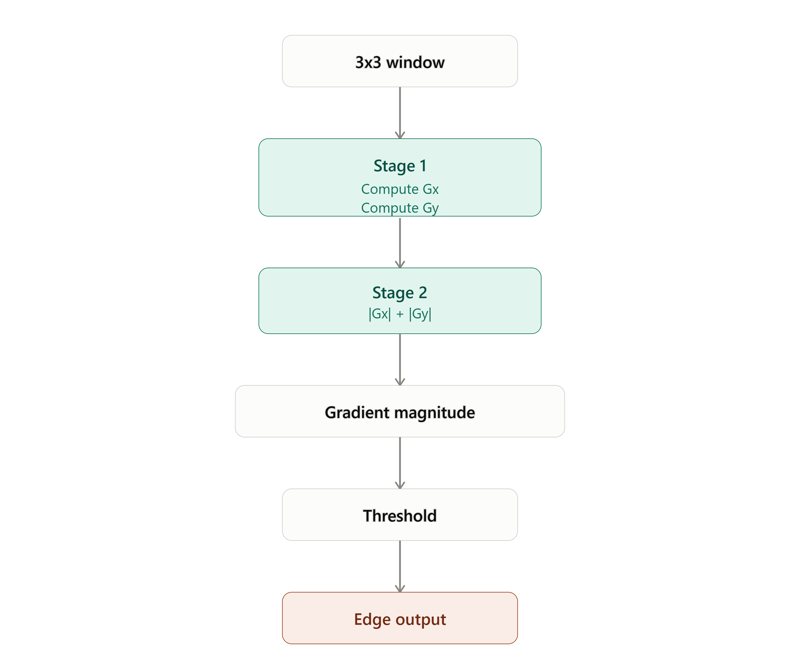
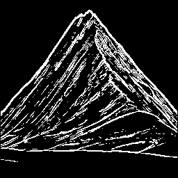
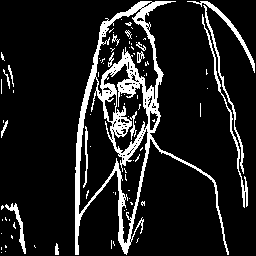
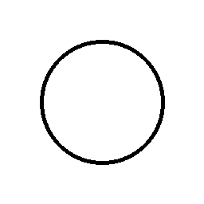
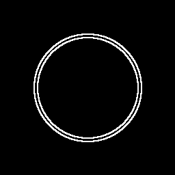
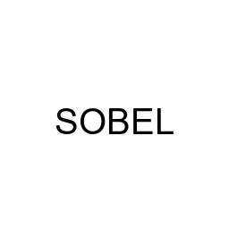
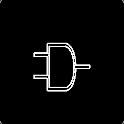

<div align="center">

#  Verilog Sobel Edge Detector Accelerator

### A Modular, Pipelined RTL Implementation of Sobel Edge Detection
<br>


</div>

---

##  Project Overview

Edge detection is a fundamental operation in computer vision used to identify boundaries, contours, and intensity transitions within an image. 
This project implements the **Sobel edge-detection algorithm as a modular hardware datapath using Verilog RTL**.

Instead of treating Sobel filtering as a software-only image-processing operation, the algorithm is decomposed into dedicated hardware stages that
process pixels in raster order through a streaming datapath.

The accelerator accepts a **24-bit RGB image**, converts it to grayscale, generates a **3×3 sliding window**, computes the horizontal and vertical Sobel
gradients, calculates a hardware-efficient gradient magnitude, and produces a binary edge map.

The complete design was functionally verified using a **self-checking Verilog testbench**, with waveform-level verification performed using **GTKWave**.

---
## What Has Been Built

The complete hardware processing pipeline is:
<div align="center">

<a href="https://uttamsengar23.github.io/Sobel-Edge-Detector/docs/sobel_pipeline_architecture.html">
  <strong>🔗 View Interactive Pipelined Sobel Datapath Architecture</strong>
</a>

</div>
---

##  Key Design Features

- **256×256, 24-bit RGB image processing**
- **8-bit grayscale + 3×3 sliding window**
- **Sobel Gx/Gy with `|Gx| + |Gy|` magnitude**
- **4-cycle pipelined datapath**
- **Raster-order streaming & coordinate tracking**
- **Configurable edge threshold**
- **Self-checking Verilog testbench**
- **Multi-image Python automation**
- **GTKWave RTL waveform verification**
---

##  Sobel Edge Detection Theory

For every valid pixel position, the `window_buffer` generates a 3×3
neighborhood:

```text
p00  p01  p02
p10  p11  p12
p20  p21  p22
```

The horizontal Sobel gradient is calculated as:

```text
Gx = (p02 + 2p12 + p22)  - (p00 + 2p10 + p20)
```

The vertical Sobel gradient is calculated as:

```text
Gy = (p20 + 2p21 + p22)- (p00 + 2p01 + p02)
```

The gradient magnitude is approximated using:

```text
G = |Gx| + |Gy|
```

instead of the mathematically exact:

```text
G = √(Gx² + Gy²)
```

### Why `|Gx| + |Gy|`?

The approximation avoids multiplication and square-root operations, resulting
in a simpler and more hardware-friendly datapath.

The resulting gradient magnitude is compared against a configurable
threshold:

```text
Gradient ≥ Threshold  →  0xFF → Edge
Gradient < Threshold  →  0x00 → Non-edge
```

The resulting binary values form the final Sobel edge map.

---

##  RTL Architecture

The design is divided into modular RTL blocks:

<div align="center">
  
| RTL Module | Responsibility |
|---|---|
| `image_memory.v` | Stores and provides 24-bit RGB image pixels |
| `rgb_to_gray.v` | Converts RGB pixels to 8-bit grayscale |
| `window_buffer.v` | Generates the 3×3 sliding pixel window |
| `sobel_core.v` | Computes Gx, Gy and gradient magnitude |
| `threshold.v` | Converts gradient magnitude to binary edge output |
| `sobel_edge_detector.v` | Top-level integration, streaming and control |

</div>

##  Pipelined Datapath

The Sobel computation is implemented as a pipelined datapath.

<div align="center">



</div>

### Pipeline Latency
<div align="center">

| Processing Stage | Module | Latency |
|---|---|---:|
| Window generation | `window_buffer` | 1 cycle |
| Sobel computation | `sobel_core` | 2 cycles |
| Thresholding | `threshold` | 1 cycle |
| **Total** | **Input window → edge output** | **4 cycles** |

</div> 

The output row and column coordinates are pipelined alongside the datapath so
that `out_row` and `out_col` remain aligned with `edge_valid`.

---

##  Control & Streaming

The top-level design uses **counter- and flag-based sequential control** rather
than an explicit FSM.

The control logic manages:

- `start`
- Image-memory address generation
- Raster-order streaming
- Input row tracking
- Input column tracking
- Last-pixel detection
- Pipeline draining
- `frame_done`

Pixels are processed in raster-scan order:

```text
(0,0) → (0,1) → (0,2) → ... → (0,255)
                                ↓
(1,0) → (1,1) → (1,2) → ... → (1,255)
                                ↓
                 ...
                                ↓
(255,0) → ... → (255,255)
```

This allows the image to flow continuously through the processing pipeline.

---

#  RTL Verification

The accelerator was verified using a **self-checking Verilog testbench**.

The verification process checks both control behavior and the expected
coverage of valid Sobel output pixels.
Detailed verification evidence is available in
[`verification/README.md`](verification/README.md).

---
# Image Processing Results

The RTL accelerator was tested across multiple image categories to demonstrate
that the same hardware processing pipeline can extract meaningful edges from
natural scenes, objects, faces, shapes, text, and circuit images.

Each example shows the **original input image** alongside its corresponding
**Sobel edge-detected output**.
<div align="center">
<table>
<tr>
<th>Original Image</th>
<th>Sobel Edge Output</th>
</tr>

<tr>
<td align="center">

<br>
<b>Mountain</b>
</td>

<td align="center">

<br>
<b>Sobel Output</b>
</td>
</tr>

<tr>
<td align="center">

<br>
<b>House</b>
</td>

<td align="center">

<br>
<b>Sobel Output</b>
</td>
</tr>

<tr>
<td align="center">

<br>
<b>Face</b>
</td>

<td align="center">

<br>
<b>Sobel Output</b>
</td>
</tr>

<tr>
<td align="center">

<br>
<b>Geometric Shape</b>
</td>

<td align="center">

<br>
<b>Sobel Output</b>
</td>
</tr>

<tr>
<td align="center">

<br>
<b>Text</b>
</td>

<td align="center">

<br>
<b>Sobel Output</b>
</td>
</tr>

<tr>
<td align="center">

<br>
<b>Circuit</b>
</td>

<td align="center">

<br>
<b>Sobel Output</b>
</td>
</tr>

</table>
</div>

> **Result:** The same RTL Sobel processing pipeline was applied across
> different image categories, producing corresponding binary edge maps.

Additional generated outputs are available in the
[`results/`](results/) directory.

---

## Automated Image Processing

Python scripts provide an end-to-end automation flow between input images,
Verilog memory files, RTL simulation, and the final Sobel edge output.

<div align="center">


</div>

The complete dataset can be processed automatically using:

```bash
python scripts/run_dataset.py
```

This automation eliminates the need to manually change image paths, regenerate
HEX files, run the RTL simulation, and convert every output back to an image.

The same flow can process multiple image categories automatically, including
natural scenes, objects, faces, geometric shapes, text, and circuit images.

---

# Author

<div align="center">

### Uttam Sengar

**Electronics & VLSI Engineering-NITJ**

</div>

